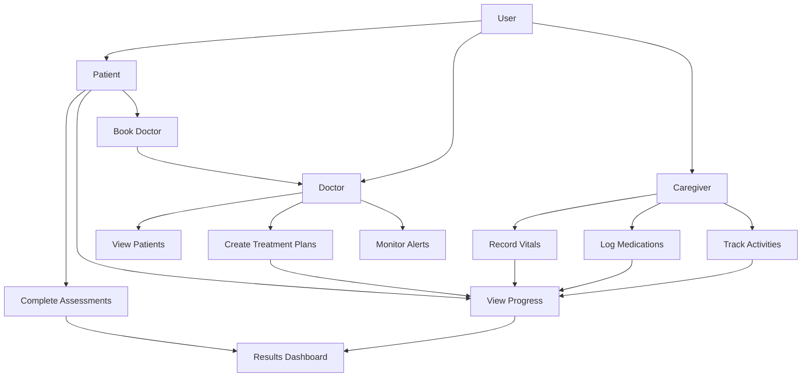
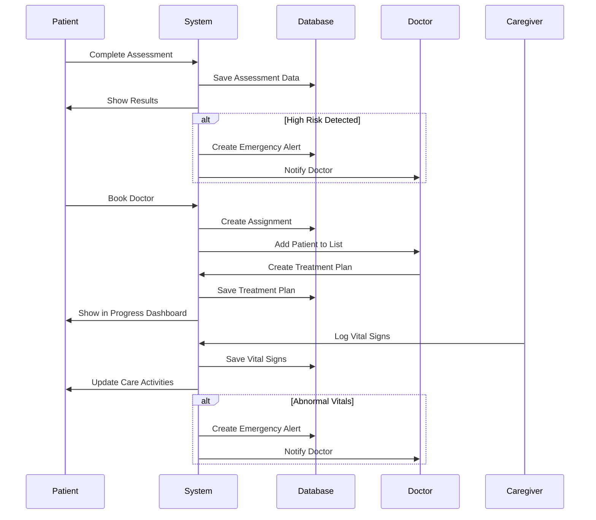
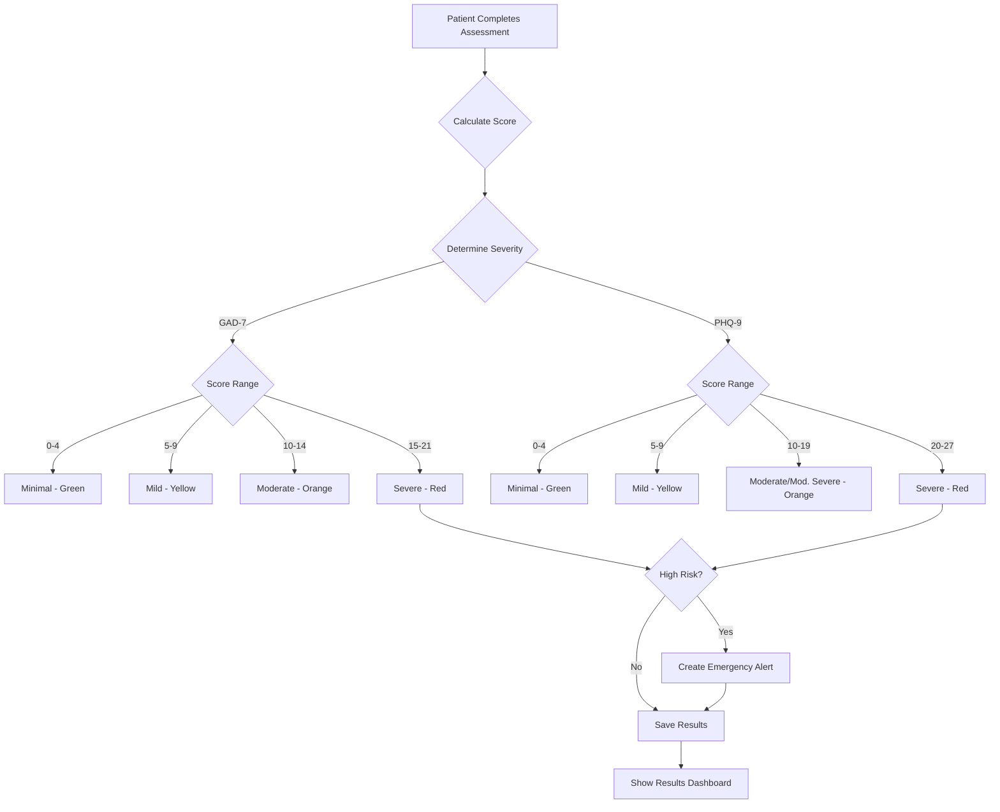
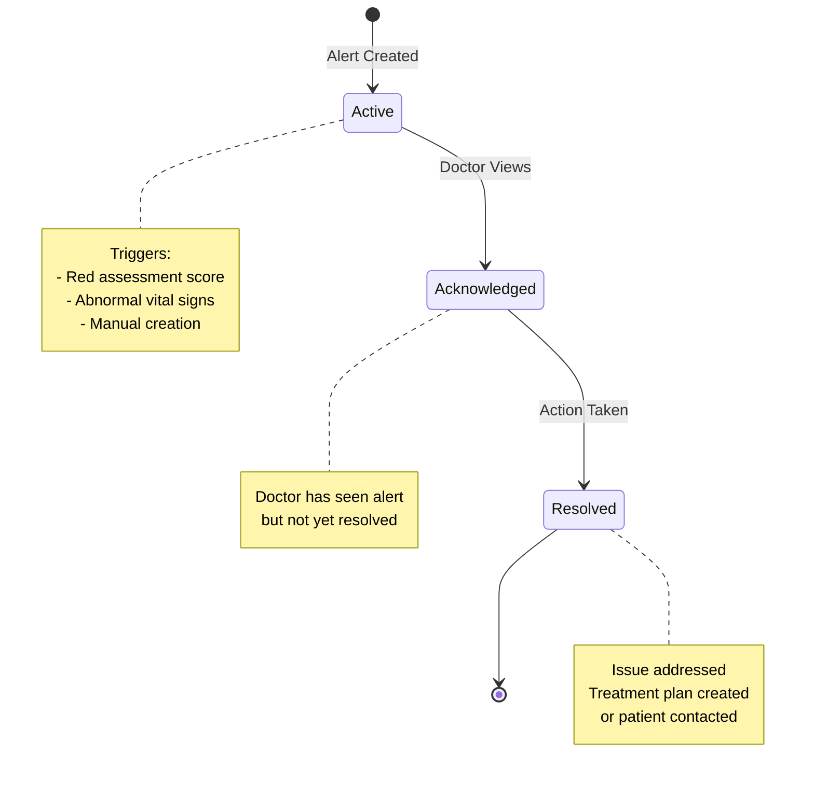

# E-Health Platform - User Flow Documentation

This document describes the complete user journey for each role in the E-Health platform: **Patient**, **Doctor**, and **Caregiver**.

## Table of Contents
- [Patient Flow](#patient-flow)
- [Doctor Flow](#doctor-flow)
- [Caregiver Flow](#caregiver-flow)
- [System Architecture](#system-architecture)

---

## Patient Flow

### 1. Registration & Authentication

#### Registration
1. Patient visits the application
2. Clicks **"Register"** button
3. Fills registration form:
   - Full Name
   - Email Address
   - Password
   - User Role: **Patient**
4. Submits form
5. System creates account and logs in automatically

#### Login
1. Patient enters email and password
2. Clicks **"Login"**
3. System validates credentials
4. JWT token generated and stored
5. Redirected to Patient Dashboard

### 2. Demographics Form (First-Time Setup)

Upon first login, patients must complete a comprehensive demographics form:

#### Personal Information
- Father/Husband Name
- CNIC (National ID)
- Age, Gender, Blood Group
- Location (Village/Town/City, Province)

#### Health Metrics
- Height & Weight
- Blood Pressure (with measurement method)
- Diabetes Level (with measurement method)
- CVD Treatment Status
- Hospital & Doctor Information (if applicable)

#### Socioeconomic Information
- Socioeconomic Status
- Education Level
- Employment Status & Type
- Monthly Salary
- Household Expenditure breakdown:
  - Health Expenditure
  - Food Expenditure
  - Travelling Expenditure

#### Family History
- Parents' cousin relationship status
- Cousin relation details

**After submission**: Patient proceeds to assessment flow

### 3. Mental Health & CVD Assessments

Patients complete four standardized assessments in sequence:

#### A. GAD-7 (Generalized Anxiety Disorder)
- **Questions**: 7 questions about anxiety symptoms
- **Response Scale**: 0-3 (Not at all, Several days, More than half the days, Nearly every day)
- **Topics Covered**:
  - Feeling nervous or on edge
  - Unable to stop worrying
  - Worrying too much
  - Trouble relaxing
  - Restlessness
  - Irritability
  - Feeling afraid
- **Scoring**: 0-21 total
- **Additional Question**: Functional impact assessment

#### B. PHQ-9 (Patient Health Questionnaire)
- **Questions**: 9 questions about depression symptoms
- **Response Scale**: 0-3 (same as GAD-7)
- **Topics Covered**:
  - Little interest or pleasure
  - Feeling down or hopeless
  - Sleep problems
  - Fatigue
  - Appetite changes
  - Feeling bad about yourself
  - Concentration difficulties
  - Psychomotor changes
  - Suicidal thoughts
- **Scoring**: 0-27 total
- **Additional Question**: Functional impact assessment

#### C. DASS-21 (Depression, Anxiety, and Stress Scale)
- **Questions**: 21 questions (7 each for Depression, Anxiety, Stress)
- **Response Scale**: 0-3 (Did not apply, Applied sometimes, Applied often, Applied very much)
- **Subscales**:
  - **Depression**: Dysphoria, hopelessness, devaluation of life
  - **Anxiety**: Autonomic arousal, situational anxiety, subjective experience
  - **Stress**: Difficulty relaxing, nervous arousal, agitation
- **Scoring**: Three separate scores (0-21 each)

#### D. CVD Risk Assessment
- **Questions**: 10 cardiovascular risk factors
- **Response Options**: Varies by question (Yes/No, ranges, categories)
- **Risk Factors Assessed**:
  1. Age
  2. Gender
  3. Smoking status
  4. Blood pressure
  5. Cholesterol levels
  6. Diabetes
  7. Family history
  8. Physical activity
  9. BMI/Weight
  10. Diet quality
- **Scoring**: Individual risk colors + overall risk level

### 4. Results Dashboard

After completing all assessments, patients see:

#### Assessment Results Display
- **GAD-7 Results**:
  - Total score (0-21)
  - Severity level (Minimal, Mild, Moderate, Severe)
  - Color indicator (Green, Yellow, Orange, Red)
  
- **PHQ-9 Results**:
  - Total score (0-27)
  - Severity level
  - Color indicator
  
- **DASS-21 Results**:
  - Depression score & severity
  - Anxiety score & severity
  - Stress score & severity
  - Individual color indicators
  
- **CVD Results**:
  - Individual risk factor colors
  - Overall risk level
  - Color indicator

#### High-Risk Alert
If any assessment shows **RED** (severe/critical):
- Emergency alert banner appears
- Recommendation to book doctor appointment immediately
- Alert sent to system (visible to doctors)

#### Action Buttons
- **View My Progress & Retake Surveys**: Navigate to progress dashboard
- **Book an Appointment**: Assign to a doctor

### 5. Progress Dashboard

Accessible anytime via **"My Progress"** button in header.

#### Assessment History
Displays historical data for all four assessments:
- **Timeline View**: Last 3 assessments per type
- **Score Trends**: Visual comparison over time
- **Color-Coded Indicators**: Quick severity assessment
- **Retake Buttons**: Retake any assessment anytime

#### Treatment Plans
Shows all treatment plans assigned by doctors:
- Plan title and description
- Goals and objectives
- Prescribed medications
- Recommended exercises
- Diet plan
- Plan status (Active/Completed)
- Start and end dates
- Assigned doctor information

#### Care Activities

**Medications**:
- Medication name
- Dosage and frequency
- Recent logs

**Vital Signs**:
- Blood pressure readings
- Heart rate
- Temperature
- Oxygen levels
- Weight tracking

**Nutrition Logs**:
- Meal types (Breakfast, Lunch, Dinner, Snacks)
- Calorie intake
- Macronutrients (Protein, Carbs, Fats)

**Exercise Logs**:
- Exercise type
- Duration
- Intensity level
- Calories burned

### 6. Survey Retake Flow

From Progress Dashboard:
1. Click **"Retake"** button on any assessment
2. System navigates to specific assessment form
3. Patient completes assessment with new responses
4. New results calculated and saved
5. Assessment history updated
6. Can return to Progress Dashboard

### 7. Doctor Booking

1. Patient clicks **"Book an Appointment"**
2. System shows available doctors
3. Patient selects a doctor
4. Doctor-patient assignment created
5. Doctor can now:
   - View patient's assessment results
   - Create treatment plans
   - Monitor progress
   - Receive emergency alerts

---

## Doctor Flow

### 1. Registration & Login

Similar to patient flow, but selects **"Doctor"** as user role.

### 2. Doctor Dashboard

Upon login, doctors see:

#### Patient List
- All assigned patients
- Patient names and contact information
- Latest assessment dates
- Risk indicators (color-coded)
- Emergency alerts (if any)

#### Quick Actions
- View patient details
- Create treatment plan
- View analytics
- Assign new patient

### 3. Patient Management

#### Viewing Patient Details
1. Click on patient from list
2. See comprehensive patient profile:
   - Demographics information
   - Complete assessment history
   - All four assessment results with trends
   - Current treatment plans
   - Care activities (medications, vitals, nutrition, exercise)
   - Emergency alerts

#### Assessment Analysis
- **GAD-7 Trends**: Anxiety levels over time
- **PHQ-9 Trends**: Depression levels over time
- **DASS-21 Trends**: Separate graphs for D, A, S
- **CVD Risk**: Risk factor breakdown

### 4. Treatment Plan Creation

1. Navigate to patient profile
2. Click **"Create Treatment Plan"**
3. Fill treatment plan form:
   - **Title**: Brief plan name
   - **Description**: Detailed explanation
   - **Goals**: Treatment objectives
   - **Medications**: Prescribed medications
   - **Exercises**: Recommended physical activities
   - **Diet Plan**: Nutritional guidelines
   - **Start Date**: Plan commencement
   - **End Date**: Expected completion (optional)
   - **Status**: Active/Completed/Cancelled
4. Submit plan
5. Patient can view plan in their Progress Dashboard

### 5. Analytics Dashboard

Provides aggregate insights:

#### Patient Statistics
- Total patients assigned
- High-risk patients count
- Active treatment plans
- Pending emergency alerts

#### Assessment Distribution
- Severity level breakdown (Minimal, Mild, Moderate, Severe)
- Risk category distribution
- Trends over time

#### Treatment Outcomes
- Treatment plan completion rates
- Patient improvement metrics
- Assessment score improvements

### 6. Emergency Alert Management

#### Alert Types
1. **High-Risk Assessment**: Automatic when patient scores RED
2. **Abnormal Vitals**: Triggered by caregiver-logged vitals
3. **Manual**: Created by doctor or caregiver

#### Alert Workflow
1. Alert appears in doctor dashboard
2. Doctor reviews patient information
3. Doctor can:
   - **Acknowledge**: Mark as seen
   - **Resolve**: Take action and close alert
   - **Create Treatment Plan**: Immediate intervention
4. Alert status updated

### 7. Patient Assignment

Doctors can manually assign patients:
1. Click **"Assign Patient"**
2. Search for patient by email or name
3. Select patient
4. Confirm assignment
5. Patient added to doctor's patient list

---

## Caregiver Flow

### 1. Registration & Login

Similar to other roles, selects **"Caregiver"** as user role.

### 2. Caregiver Dashboard

Upon login, caregivers see:

#### Assigned Patients
- List of patients under care
- Patient names and basic information
- Recent vital signs
- Medication schedules
- Upcoming tasks

### 3. Patient Monitoring

#### Patient Selection
1. Click on patient from list
2. View patient overview:
   - Demographics
   - Current medications
   - Recent vital signs
   - Nutrition and exercise logs
   - Treatment plan details

### 4. Vital Signs Recording

1. Navigate to patient profile
2. Click **"Record Vital Signs"**
3. Enter measurements:
   - **Blood Pressure**: Systolic/Diastolic
   - **Heart Rate**: Beats per minute
   - **Temperature**: In Celsius/Fahrenheit
   - **Oxygen Level**: SpO2 percentage
   - **Weight**: In kg/lbs
   - **Notes**: Additional observations
4. Submit record
5. System checks for abnormal values
6. If abnormal: Emergency alert created

### 5. Medication Management

#### Logging Medication Administration
1. Click **"Log Medication"**
2. Select or enter medication details:
   - Medication name
   - Dosage
   - Frequency
   - Time administered
   - Start and end dates
   - Notes
3. Submit log
4. Medication appears in patient's care activities

#### Medication Reminders
- View upcoming medication schedules
- Mark medications as administered
- Track adherence

### 6. Nutrition Logging

1. Click **"Log Nutrition"**
2. Enter meal information:
   - **Meal Type**: Breakfast, Lunch, Dinner, Snack
   - **Foods**: Description of meal
   - **Calories**: Total caloric intake
   - **Macronutrients**:
     - Protein (grams)
     - Carbohydrates (grams)
     - Fats (grams)
   - **Notes**: Additional details
3. Submit log
4. Data visible in patient's progress dashboard

### 7. Exercise Logging

1. Click **"Log Exercise"**
2. Enter activity details:
   - **Exercise Type**: Walking, Running, Yoga, etc.
   - **Duration**: Minutes
   - **Intensity**: Low, Medium, High
   - **Calories Burned**: Estimated
   - **Notes**: Additional observations
3. Submit log
4. Data visible in patient's progress dashboard

### 8. Communication with Doctors

Caregivers can:
- View treatment plans created by doctors
- Follow medication and care instructions
- Report concerns via emergency alerts
- Coordinate care activities

---

## System Architecture

### User Role Hierarchy



### Data Flow



### Assessment Scoring Logic



### Emergency Alert System



---

## Key Features Summary

### For Patients
✅ Complete standardized mental health and CVD assessments  
✅ View color-coded results with severity levels  
✅ Track assessment history and progress over time  
✅ Retake any assessment at any time  
✅ View assigned treatment plans  
✅ Monitor care activities (medications, vitals, nutrition, exercise)  
✅ Book appointments with doctors  

### For Doctors
✅ Manage assigned patients  
✅ View comprehensive patient profiles  
✅ Analyze assessment trends and patterns  
✅ Create personalized treatment plans  
✅ Receive and manage emergency alerts  
✅ Access analytics dashboard  
✅ Assign new patients  

### For Caregivers
✅ Monitor assigned patients  
✅ Record vital signs  
✅ Log medication administration  
✅ Track nutrition intake  
✅ Log exercise activities  
✅ View treatment plans  
✅ Create emergency alerts for abnormal observations  

---

## Navigation Summary

### Patient Navigation
```
Login → Demographics → Assessments → Results → Progress Dashboard
                                        ↓
                                   Book Doctor
                                        ↓
                                   Doctor Assigned
```

### Doctor Navigation
```
Login → Dashboard → Patient List → Patient Profile → Treatment Plan
                         ↓
                   Analytics Dashboard
                         ↓
                   Emergency Alerts
```

### Caregiver Navigation
```
Login → Dashboard → Patient List → Patient Profile → Record Data
                                                         ↓
                                            (Vitals/Meds/Nutrition/Exercise)
```

---

**This comprehensive flow ensures seamless coordination between patients, doctors, and caregivers for optimal mental health and cardiovascular care management.**
